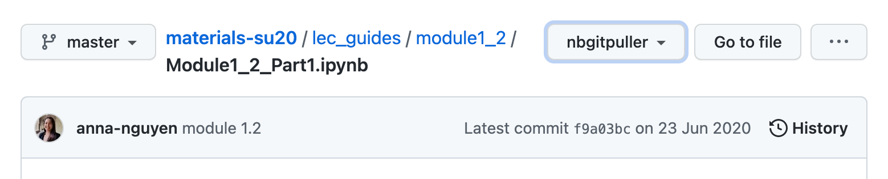
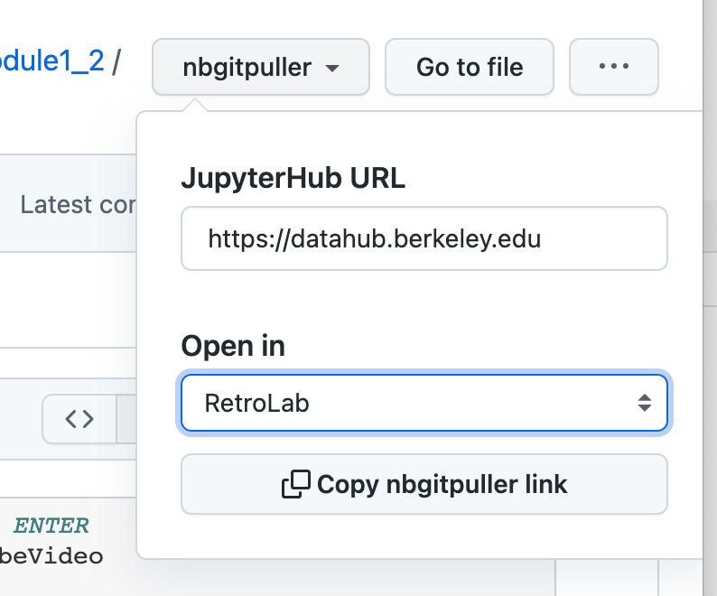

# nbgitpuller Link Generator WebExtension

A browser extension to help you generate [nbgitpuller](https://jupyterhub.github.io/nbgitpuller/)
links directly from GitHub.

## What does this do?

On the GitHub page for files, folders and repositories, it adds an
'nbgitpuller' button.



On clicking this, you can enter a JupyterHub URL and the application
you want to use to open this file, folder or repository. Then you
can just copy the nbgitpuller URL, and share it with your students!



The JupyterHub URL and application you choose are remembered, so
you do not need to enter it over and over again.

## Installation

The extension has been submitted to the Mozilla and Chrome addon stores,
but takes a while to get approved. In the meantime, you can install it
manually and test it out!

### On Firefox

1. Download the `.zip` version of the latest [release](https://github.com/yuvipanda/nbgitpuller-link-generator/releases)
   of the extension. You want the file named `nbgitpuller_link_generator-<version>.zip`.
2. In your firefox, go to the [about:debugging](about:debugging#/runtime/this-firefox) page,
   and select the 'This Firefox' tab on the left.
3. Under *Temporary Extensions*, click *Load Temporary Add-on...*.
4. Navigate to the `.zip` file you downloaded in step 1, and select that
5. This should enable the addon! If you go to any repo on GitHub, you should see
   the nbgitpuller button now!

You can find more information [here](https://developer.mozilla.org/en-US/docs/Tools/about:debugging#extensions).

### On Google Chrome / Chromium

1. Download the `.zip` version of the latest [release](https://github.com/yuvipanda/nbgitpuller-link-generator/releases)
   of the extension. You want the file named `nbgitpuller_link_generator-<version>.zip`.
2. Extract the `.zip` file you downloaded.
3. In your Google Chrome / Chromium, go to [chrome://extensions](chrome://extensions/).
4. Enable the *Developer Mode* toggle in the top right. This should make a few options visible
   in a new toolbar.
5. Select *Load Unpacked*, and select the directory into which the downloaded `.zip` file
   was extracted to. This directory should contain at least a `manifest.json` file that
   was part of the `.zip` file.

You can find more information [here](https://developer.chrome.com/docs/extensions/mv3/getstarted/#manifest).

## Building the webextension

```bash
npm install
npx webpack --mode=production
npx web-ext build -s dist/
```

This produces a `.xpi` file in `web-ext-artifacts/` you can use.