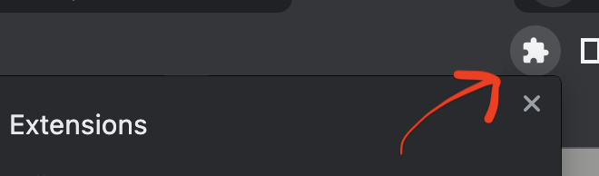
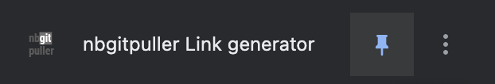
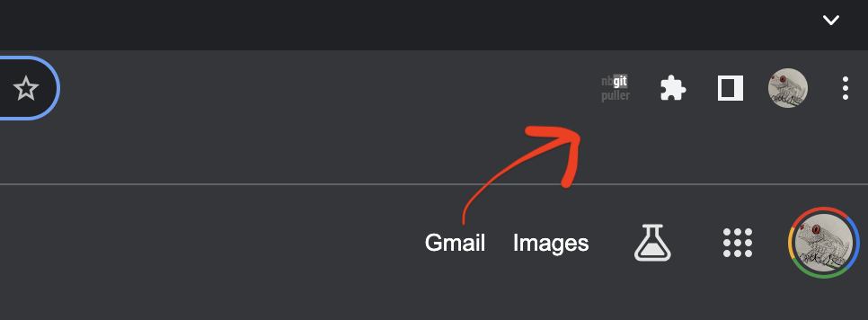
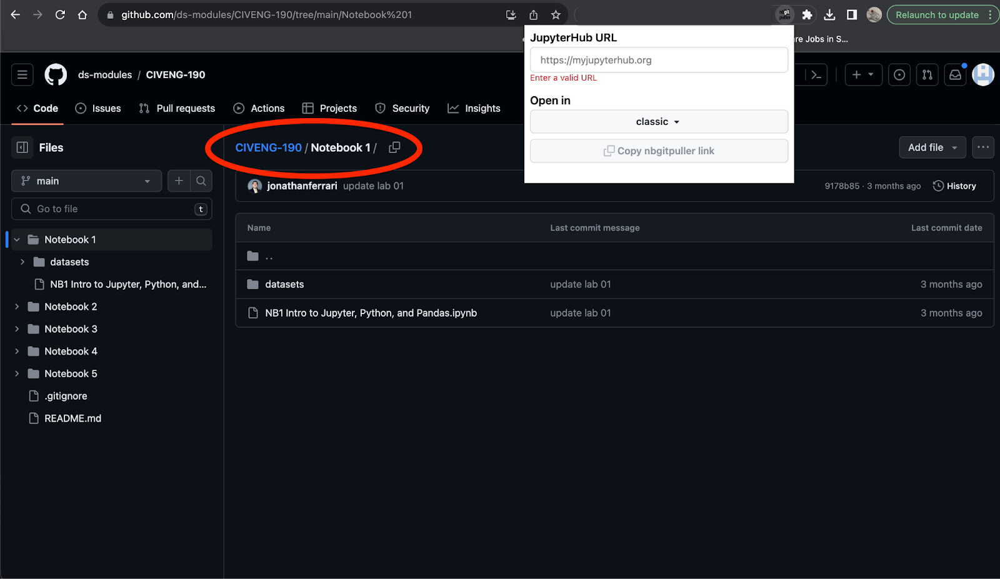
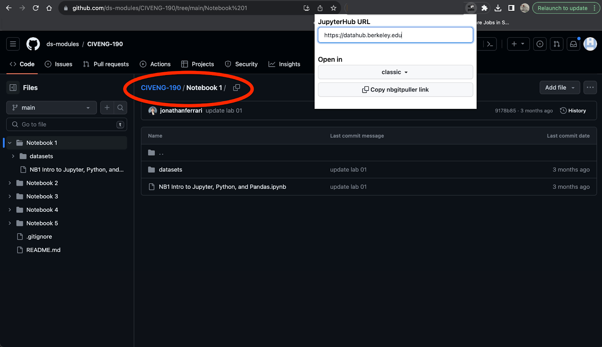
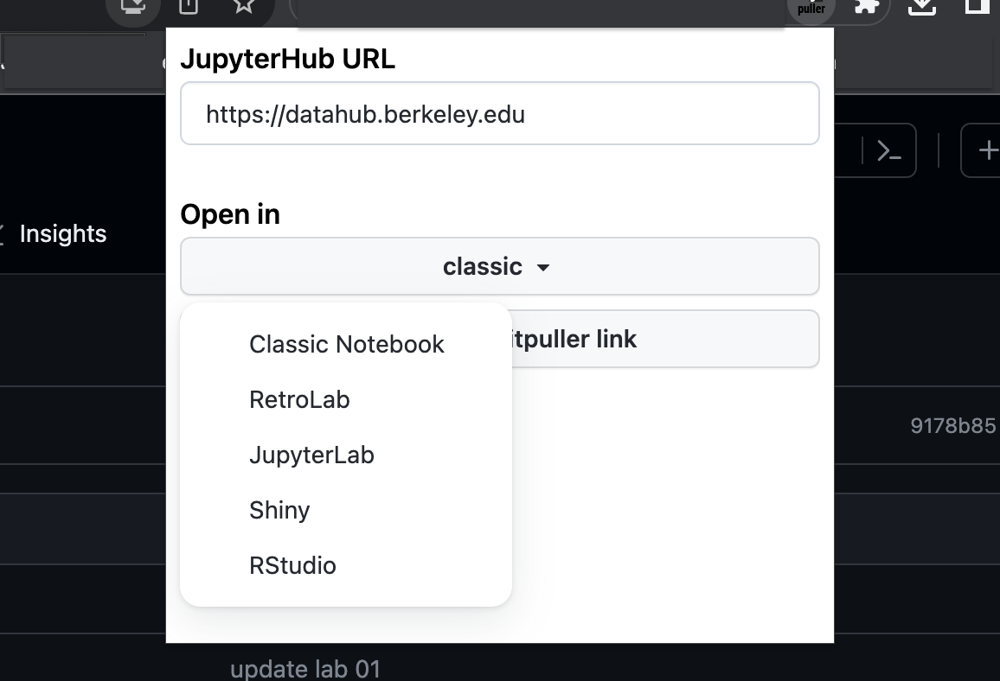
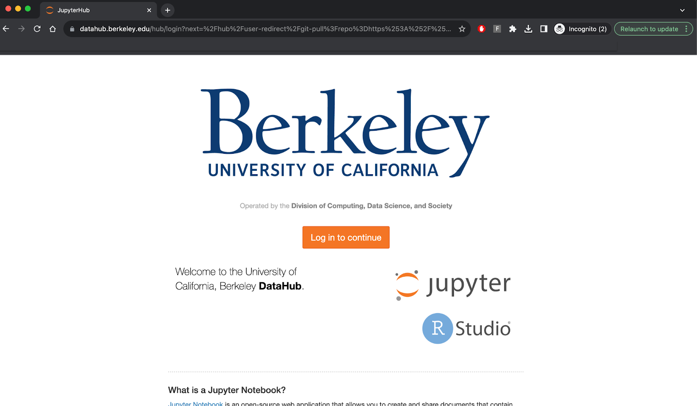
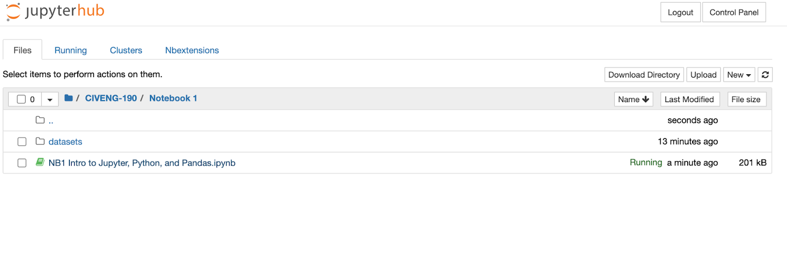

# ❗️nbgitpuller extension

> 🚨Setup and tutorial instructions for using the nbgitpuller chrome extension for assignment distribution

## ❗️setup - nbgitpuller extension

Upon installation, select the puzzle piece located in the upper-right corner of your Chrome tab.

Click on the pin button to make sure nbgitpuller stays pinned at the top of the screen.

From now on, you can access nbgitpuller directly from the Chrome toolbar.

## ❗️ tutorial - nbgitpuller extension

To begin, navigate to the relevant folder within the assignment’s GitHub repository containing notebooks. Select the nbgitpuller extension in the browser, and you will have options to enter the Hub URL and the interface to launch the notebook.

Enter the URL to the hub that you use for administering your assignments. E.g.: "[https://datahub.berkeley.edu](https://www.google.com/url?q=https://datahub.berkeley.edu&sa=D&source=editors&ust=1704918064934417&usg=AOvVaw1lIlYFhcEVYh8wOMxgpO84)."

> 🚨 Note: Once the JupyterHub URL is specified once, nbgitpuller will autofill it the next time, no need to keep inputting it.

Following that, indicate the notebook interface that students should use for working with the notebooks. The options are Classic Notebook, Retrolab, JupyterLab, and RStudio for R assignments. You can launch Python notebooks using Jupyter interfaces such as Classic Notebook, RetroLab, and JupyterLab.

> 🚨 Note: Again, npgitpuller will remember your last choice of notebook style, so you don’t have to keep specifying it for multiple assignments.

Students receive this link, and when they click on it, a new tab opens, prompting them to log in with their credentials (such as UC Berkeley credentials).

The first time a particular student clicks the link, a local copy of the repository is made for the student. On successive clicks, the latest version of the remote repository is fetched, and merged automatically with the student’s local copy using a  [series of rules](https://www.google.com/url?q=https://nbgitpuller.readthedocs.io/en/latest/topic/automatic-merging.html%23topic-automatic-merging&sa=D&source=editors&ust=1704918064935913&usg=AOvVaw2M50NQloc1shQ3aFvM3MdX) that ensure students never get merge conflicts nor lose any of their changes.

On log in, it creates a copy of the code from github for each student, and provides an environment for students to edit notebooks:

